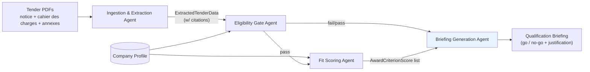

# Agentic Tender Assistant

Agentic system that ingests Swiss public tender documents (simap.ch), extracts
their requirements, and produces a structured qualification briefing to support
a bidder's go/no-go decision — every extracted fact traceable to its source
document.

Built for the HPE & NVIDIA Agentic AI Hackathon for Enterprises (Swiss AI Weeks).

See [CHALLENGE.md](./CHALLENGE.md) for the official brief and
[docs/architecture.md](./docs/architecture.md) for the full pipeline design.

## Architecture



## Why this isn't just a summarizer

- **Eligibility criteria** (certifications, insurance, references, ...) are
  binary pass/fail — missing one disqualifies the bid outright. Handled
  deterministically by the eligibility gate, never left to model judgment.
- **Award criteria** (price, quality, timeline, sustainability, ...) are
  weighted/scored — handled by the fit scoring agent, only run once
  eligibility passes.
- Every extracted fact (deadline, criterion, requirement) carries a
  `Citation` (document + page/section) back to source. No ungrounded
  assertions.
- Tender documents may be in French, German, or Italian.

## Repo structure

```
src/
  schemas/       shared Pydantic contracts between agents (start here)
  agents/
    ingestion.py         Track A — parsing, extraction, citations, multilingual
    eligibility_gate.py  Track B — deterministic pass/fail
    fit_scoring.py       Track B — weighted scoring
    briefing.py          Track C — final structured briefing
  pipeline.py    Track C — orchestration + CLI entry point
data/
  sample_tenders/             local PDF inputs (gitignored, see its README)
  company_profile.example.json
tests/           mirrors src/, one test module per agent + schema tests
docs/architecture.md   detailed pipeline design, kept in sync with code
```

## Team split

- **Track A — Ingestion & extraction**: `src/agents/ingestion.py`
- **Track B — Eligibility & scoring**: `src/agents/eligibility_gate.py`, `src/agents/fit_scoring.py`
- **Track C — Briefing & orchestration**: `src/agents/briefing.py`, `src/pipeline.py`, CLI/demo

All three tracks build against the shared contracts in `src/schemas/` —
implement against those interfaces and you're not blocked on each other's
progress.

## Setup

```bash
python3.11 -m venv .venv
source .venv/bin/activate
pip install -e ".[dev]"
cp .env.example .env  # fill in your LLM provider API key
```

Run tests:

```bash
pytest
```

Run the pipeline once your track's piece is implemented:

```bash
python -m src.pipeline data/sample_tenders/<tender-id> data/company_profile.example.json
```

## Status

Skeleton stage — schemas are defined, agent modules are stubbed with
`NotImplementedError` and `# TODO(track-x)` markers, orchestration wiring
exists in `src/pipeline.py`. No agent logic is implemented yet; each track can
now branch off `main` independently.


## Hermes environment

See [NemoHermes setup](docs/NEMOHERMES_SETUP.md) for the sandbox, SIMAP and dashboard configuration.
