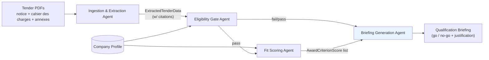

# Agentic Tender Assistant

Agentic system that ingests Swiss public tender documents (simap.ch), extracts
their requirements, and produces a structured qualification briefing to support
a bidder's go/no-go decision — every extracted fact traceable to its source
document.

Built for the HPE & NVIDIA Agentic AI Hackathon for Enterprises (Swiss AI Weeks).

See [docs/CHALLENGE.md](./docs/CHALLENGE.md) for the official brief,
[docs/architecture.md](./docs/architecture.md) for the full pipeline design,
and [CLAUDE.md](./CLAUDE.md) for repo conventions and commands.

## Architecture



## Why this isn't just a summarizer

- **Eligibility criteria** (certifications, insurance, references, ...) are
  binary pass/fail — missing one disqualifies the bid outright. Handled
  deterministically by the eligibility gate, never left to model judgment.
- **Award criteria** (price, quality, timeline, sustainability, ...) are
  weighted/scored — handled by the fit scoring agent, only run once
  eligibility passes.
- Every extracted fact (deadline, criterion, requirement) carries a
  `Citation` (document + page/section) back to source. No ungrounded
  assertions.
- Tender documents may be in French, German, or Italian.

## Repo structure

```
src/
  schemas/       shared Pydantic contracts between agents (start here)
  agents/
    ingestion.py         Track A — parsing, extraction, citations, multilingual
    eligibility_gate.py  Track B — deterministic pass/fail
    fit_scoring.py       Track B — weighted scoring
    briefing.py          Track C — final structured briefing
    tender_search.py     Track A (stretch) — live discovery via Tavily, see docs/aiq-blueprint.md
  pipeline.py    Track C — orchestration + CLI entry point + NAT registration
configs/         NeMo Agent Toolkit (`nat`) workflow configs (CLI + MCP server)
integrations/
  simap/         simap.ch MCP server groundwork (stretch goal, architecturally broken — see its README)
data/
  sample_tenders/             local PDF inputs (gitignored, see its README)
  company_profile.example.json
tests/           mirrors src/, one test module per agent + schema tests
docs/
  architecture.md   detailed pipeline design, kept in sync with code
  aiq-blueprint.md  Tavily web search (Hermes native + this repo) and the AI-Q Blueprint's status
  CHALLENGE.md      official hackathon brief
CLAUDE.md        repo conventions for coding agents (and humans)
```

## Team split

- **Track A — Ingestion & extraction**: `src/agents/ingestion.py`
- **Track B — Eligibility & scoring**: `src/agents/eligibility_gate.py`, `src/agents/fit_scoring.py`
- **Track C — Briefing & orchestration**: `src/agents/briefing.py`, `src/pipeline.py`, CLI/demo

All three tracks build against the shared contracts in `src/schemas/` —
implement against those interfaces and you're not blocked on each other's
progress.

## Setup

```bash
./scripts/setup.sh
```

Or manually:

```bash
python3.11 -m venv .venv
source .venv/bin/activate
pip install -e ".[dev]"
pre-commit install
cp .env.example .env  # fill in your LLM provider API key
```

Run tests:

```bash
pytest
```

Run the pipeline once your track's piece is implemented — either directly:

```bash
python -m src.pipeline data/sample_tenders/<tender-id> data/company_profile.example.json
```

or through the NeMo Agent Toolkit (see `docs/architecture.md` "Orchestration"):

```bash
nat run --config_file configs/tender_assistant.yml \
  --input '{"tender_folder": "data/sample_tenders/<tender-id>", "company_profile_path": "data/company_profile.example.json"}'
```

Live tender discovery (finding candidates, not extracting from PDFs you already have) calls
Tavily directly — set `TAVILY_API_KEY` in `.env` (see
[docs/aiq-blueprint.md](./docs/aiq-blueprint.md) for how this relates to Hermes's own native
Tavily integration), then:

```bash
nat run --config_file configs/tender_live_search.yml \
  --input '{"query": "fourniture informatique Lausanne", "company": {"company_name": "Acme SA", "capabilities": ["IT services"]}}'
```

## Hermes

This environment runs inside a NemoClaw-managed Hermes sandbox (`tender-assistant`). Two
separate integration points:

- **Web search**: NemoClaw has native Tavily support for Hermes sandboxes (not generic MCP) —
  not yet enabled for this sandbox (needs a real `TAVILY_API_KEY` and sandbox recreation); see
  `docs/aiq-blueprint.md` "Hermes's native Tavily web search" for the exact commands.
- **This pipeline as a tool**: `nat mcp --config_file configs/tender_assistant_mcp.yml` is meant
  to serve it as an MCP tool Hermes can call — but NemoClaw only registers authenticated
  Streamable HTTPS MCP endpoints, so that alone isn't enough; see `docs/architecture.md`
  "Orchestration" for the concrete gap (same one originally blocked `integrations/simap/`, see
  its README).

## Status

Skeleton stage — schemas are defined, the four core pipeline agent modules are stubbed
with `NotImplementedError` and `# TODO(track-x)` markers, orchestration wiring exists in
`src/pipeline.py`. No core agent logic is implemented yet; each track can now branch off
`main` independently. Exception: `src/agents/tender_search.py` (live tender discovery via
Tavily) is real, working code — see [docs/aiq-blueprint.md](./docs/aiq-blueprint.md).

## Tender-as-Code qualification layer (current work)

The product core compiles natural-language tender clauses into executable
requirements and evaluates them deterministically — see
[docs/JURY_DEMO.md](./docs/JURY_DEMO.md) for the walkthrough:

- **Tender Compiler** (`src/opportunity/compiler.py`): clause → rule IR with
  compile statuses VERIFIED / NEEDS_REVIEW / AMBIGUOUS / UNSUPPORTED. Hedged or
  threshold-free clauses are never given invented deterministic meaning; an
  LLM-proposed candidate (Nemotron/H100, planned) is accepted only through the
  deterministic `validate_candidate` gate.
- **Deterministic engine** (`src/opportunity/engine.py`): PASS / FAIL / UNKNOWN
  with proof chains (clause → rule → fact → evidence → verdict). Evidence
  validity is judged against the **submission deadline**, not today: a record
  that expires before the deadline is PROVED NOT MET.
- **Facts ≠ evidence** (`src/opportunity/facts.py`): trust classes
  VERIFIED_INTERNAL / VERIFIED_PUBLIC / INFERRED / SIMULATED with provenance
  and validity windows. Inferred statements never satisfy our mandatory rules.
- **Generated tender unit tests** (`src/opportunity/tender_tests.py`): boundary
  tests per compiled rule; a failing generated test is a compilation defect.
- **Competitive landscape** (`src/opportunity/competitors.py`): entity
  resolution + public-records-only competitor qualification
  (PUBLICLY SUPPORTED / PUBLIC NON-MATCH / UNKNOWN).
- **Strategy** (`src/opportunity/strategy.py`): capability-gap aggregation,
  non-mutating what-if simulation, capacity-constrained portfolio planning.
- **Immutable raw sources** (`src/opportunity/sources.py`): captured notices
  are stored per tender version with SHA-256 (`data/raw/simap/`).
- **Evaluation** (`python -m src.opportunity.evaluation`): decision accuracy,
  critical false PASSes, compilation error rate, citation integrity,
  prompt-injection invariance.
