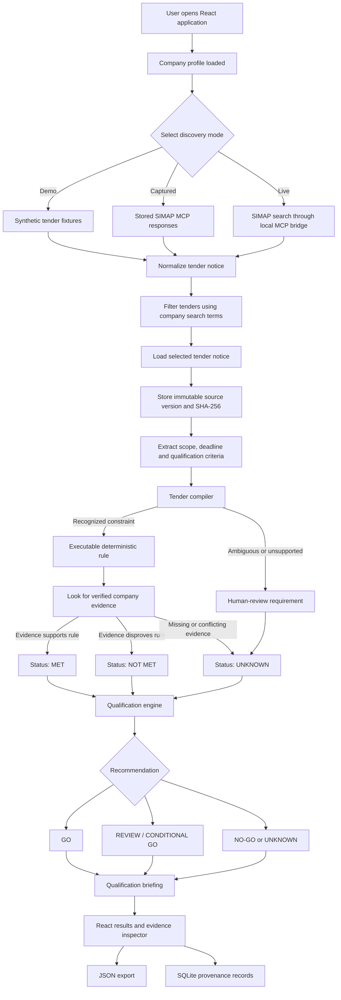
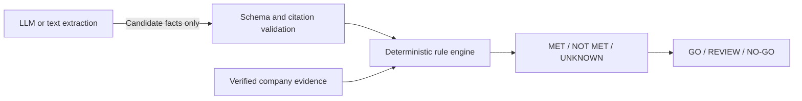

# Deployed Application Flow and Technical Overview

## Application flow



## How the product works

The application helps a Swiss SME assess whether it should pursue a public tender. It supports qualification; it does not write or submit bids.

### 1. Company context

The backend loads a company profile containing capabilities, locations, languages, references, certifications, capacity, and search terms. Verified evidence is kept separate from self-declared profile data.

### 2. Tender discovery

The user selects one of three modes:

- **Demo:** synthetic demonstration tenders and evidence.
- **Captured:** previously captured real SIMAP responses for an offline demonstration.
- **Live:** calls SIMAP tools through the repository's local Node MCP bridge.

### 3. Notice processing

SIMAP responses are normalized into typed Python models. The application extracts:

- tender title and buyer;
- location and deadline;
- scope summary;
- qualification criteria;
- source quotes and JSON-section references.

### 4. Requirement compilation

Each published criterion is passed through a deterministic compiler:

- Clear, supported clauses can become executable rules.
- Ambiguous clauses are marked `NEEDS_REVIEW`.
- Unsupported clauses remain `UNKNOWN`.
- Missing evidence is never silently treated as compliance.

### 5. Evidence evaluation

Executable rules are compared with verified company evidence. Possible outcomes are:

- **MET:** evidence satisfies the requirement.
- **NOT MET:** evidence proves the requirement is not satisfied.
- **UNKNOWN:** evidence is missing, conflicting, expired, or the clause cannot be safely interpreted.

### 6. Recommendation

A deterministic engine aggregates mandatory checks into a recommendation. An unresolved mandatory requirement blocks a confident `GO`.

### 7. Briefing and provenance

The UI presents the recommendation, checklist, risks, actions, and evidence chain. Runs are saved to SQLite, while raw tender versions are stored with hashes to detect changes.

## Technical architecture

| Layer | Current technology | Responsibility |
|---|---|---|
| Frontend | React, TypeScript, Vite | Discovery controls, tender results, evidence inspector, and export |
| API | FastAPI | Bridge between the frontend and qualification workflow |
| Orchestration | NVIDIA NeMo Agent Toolkit | Registered fixed-sequence workflow and four reusable functions |
| SIMAP integration | Typed Python adapter plus Node MCP bridge | Search and retrieve SIMAP notices |
| Validation | Pydantic | Request, response, and opportunity contracts |
| Rule engine | Deterministic Python logic | Mandatory-requirement evaluation and recommendations |
| Document handling | Python ingestion components | Text/PDF parsing and source metadata |
| Storage | SQLite plus immutable raw files | Provenance, runs, results, versions, and hashes |
| Optional AI | OpenAI-compatible endpoint | Candidate extraction only; never the final eligibility judge |
| Export | JSON | Downloadable qualification-run record |

The NeMo Agent Toolkit workflow contains four functions:

```text
search_simap
    -> load_tender
        -> qualify_tender
            -> build_briefing
```

## Safety model



The core product principle is:

> Missing, conflicting, or ambiguous evidence must produce `UNKNOWN`, never `MET`.

## Current deployment status

The implemented baseline is operational:

- 133 backend tests pass.
- The production React build succeeds.
- Both NeMo Agent Toolkit configurations validate.
- The captured German/French tender completes through `nat run`.
- The implementation is maintained on the `Ishaan_AI_Deployment` branch.

## Remaining PRD gaps

The deployed implementation is not yet the complete PRD target:

- Live mode uses the repository-local SIMAP bridge rather than the existing Hermes MCP connection.
- The company profile is displayed but cannot yet be created or edited in the UI.
- Manual tender URL/ID import is not available through the main UI.
- Full tender-annex downloading and PDF ingestion are not connected to the live flow.
- Real bidder evidence is not configured; real notices therefore remain conservatively `UNKNOWN`.
- Final pursuit-decision override and recording are missing.
- Export is JSON only; HTML export is missing.
- Award criteria and published weights are not fully represented.
- The NeMo Agent Toolkit environment reports an optional missing `langchain_core` plugin dependency, although validation and captured execution still succeed.

The current application therefore demonstrates a safe notice-to-briefing vertical slice. Completing the remaining integrations above is required for the full production workflow described in the PRD.
